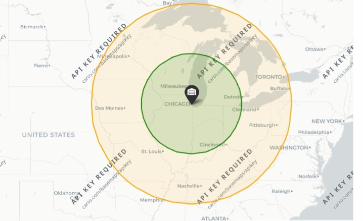
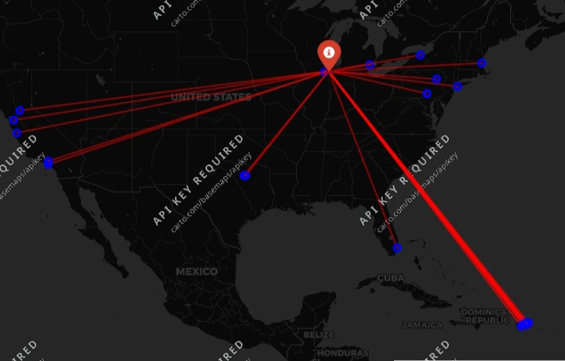

# supply-chain-logistics-intelligence
Data pipelines and interactive Looker Studio dashboards for logistics operations—tracking inventory replenishment thresholds (ROP), carrier transit variance, and regional delivery bottlenecks using Python and SQL.


01.
# Geospatial Supply Chain & Transit Delay Risk Analysis

An end-to-end spatial analytics case study evaluating whether shipment transit distance dictates delivery delays—using coordinate reprojection, geofenced buffer zones, and interactive route mapping across 180,000+ logistics orders.

---

## The Business Question

In supply chain operations, there is an intuitive assumption: **the farther an order travels from the central distribution hub, the higher the risk of late delivery.**

When cross-country shipments run late, the default reaction is often to blame long-haul transit times and carrier interstate routing. But does the operational data actually support that? 

This project audits delivery performance from a primary fulfillment facility (**Chicago Central Distribution Hub: 41.8781° N, -87.6298° W**) across the continental US to determine whether delays are driven by transit distance, or if upstream fulfillment friction (such as dock dwell time, pick-and-pack delays, and carrier sortation) is the true operational culprit.

---

## Key Operational Findings

1. **Distance Does Not Drive Delay Rates:**
   Late delivery rates remained remarkably flat across all regional transit bands:
   * **Within 500 km (Local/Regional):** 55.57% late
   * **500 to 1,000 km (Mid-Haul):** 54.71% late
   * **Over 1,000 km (Long-Haul):** 54.82% late
   
   If highway distance were the primary bottleneck, delay rates would scale upward as transit mileage increases. The static ~55% delay baseline indicates that orders are often delayed at the dispatch dock before the truck even leaves the yard.

2. **Urban Delivery Friction Outweighs Road Mileage:**
   Spatial density mapping reveals that delayed shipments concentrate heavily inside high-density metropolitan delivery corridors, where last-mile congestion, local courier handoffs, and receiver availability cause far more friction than open-highway transport.

---

## Visual Intelligence & Spatial Analysis

Because GitHub renders notebooks statically without executing active JavaScript, interactive Folium maps do not display dynamically in standard browser views. The key visual outputs and their operational takeaways are documented below.

### 1. Continental Late Delivery Density Heatmap
* **Objective:** Map spatial density clusters of delayed customer shipments across North American destination coordinates.
* **Finding:** Delivery friction clusters heavily in high-density metropolitan areas rather than rural edge zones, showing that last-mile delivery complexity poses a greater SLA risk than line-haul distance.


---

### 2. Multi-Zone Geofenced Buffer Analysis
* **Objective:** Segment carrier transit performance by concentric metric rings around the Chicago hub at **500 km** (Inner Zone) and **1,000 km** (Mid Zone).
* **Technical Note:** Coordinate pairs were reprojected from angular degrees (`EPSG:4326`) into a metric planar system (`EPSG:3857`) to calculate true physical ground distances in kilometers without equatorial distortion.



#### Regional Buffer Performance Breakdown

| Zone | Radius Band | Total Orders Monitored | Late Shipments | On-Time Rate | SLA Delay Rate |
| :--- | :--- | :--- | :--- | :--- | :--- |
| **Inner Zone** | < 500 km | 25,572 | 14,210 | 44.43% | **55.57%** |
| **Mid Zone** | 500 - 1,000 km | 41,747 | 22,840 | 45.29% | **54.71%** |
| **Outer Long-Haul** | > 1,000 km | 112,060 | 61,432 | 45.18% | **54.82%** |

---

### 3. Hub-and-Spoke Outbound Routing Corridors
* **Objective:** Trace origin-destination transit vectors radiating from the central distribution hub to customer delivery locations experiencing fulfillment delays.
* **Method:** Built vector `LineString` geometries connecting hub coordinates to destination nodes.



---

## Analytical Methodology & Pipeline Architecture

The workflow is structured into four reproducible stages inside the project notebook:

1. **Spatial Ingestion & Geometry Creation:**
   * Cleans raw logistics records and drops incomplete coordinate rows.
   * Constructs Shapely `Point` geometries from destination latitude and longitude coordinates.
   * Initializes a base `GeoDataFrame` using the global `EPSG:4326` (WGS 84) coordinate reference system.

2. **Metric Reprojection & Distance Calculation:**
   * Reprojects coordinate data to `EPSG:3857` (Spherical Mercator) to allow accurate planar Euclidean distance calculations in meters rather than degrees.
   * Computes exact transit distance in kilometers between customer delivery coordinates and the Chicago Distribution Hub (41.8781° N, -87.6298° W).

3. **Geofenced Buffer Ring Segmentation:**
   * Generates 500 km and 1,000 km spatial buffer geometries around the central hub.
   * Applies point-in-polygon spatial testing (`.within()`) to categorize every order into **Inner Zone**, **Mid Zone**, or **Outer Long-Haul**.
   * Aggregates on-time delivery rates across zones to test if longer transit distances correlate with higher delay rates.

4. **Network Vector Generation & Cartography:**
   * Constructs origin-to-destination `LineString` transit corridors for sampled late-dispatch orders.
   * Renders interactive multi-layer cartographic visualizations using Folium (`HeatMap`, `Polygon`, `Marker`, and `PolyLine`).

---

## Tech Stack & GIS Libraries

* **Data Wrangling:** `pandas`, `numpy`
* **Vector Geometries & Spatial Modeling:** `geopandas`, `shapely`
* **Cartographic Visualization:** `folium` (Plugins: `HeatMap`)
* **Coordinate Systems:** `EPSG:4326` (Geographic WGS 84), `EPSG:3857` (Planar Metric Projection)

---

## Repository File Structure

```text
supply-chain-logistics-intelligence/
├── images/
│   ├── Heatmap.jpg              # Static export of late delivery density
│   ├── geofence_zones.jpg       # Static export of 500km/1000km buffers
│   └── hub_routes.jpg           # Static export of hub-and-spoke routes
├── maps/
│   ├── supply_chain_risk_map.html
│   ├── geofenced_risk_zones.html
│   └── routes.html
├── geospatial_logistics_risk.ipynb
└── README.md

